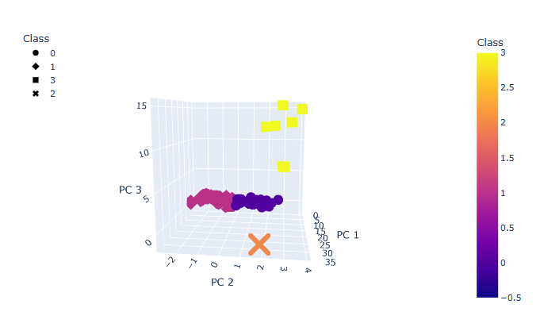

# Cryptocurrencies

## 1. Overview of the analysis:
    we want to see how Bitcoin performs over time, or in other word we want to figure out what kinds of coins a user is most likely to buy. We use unsupervised learning as we don't yet know the what is the result of the data. We just want to figure out if there is anything at all the data can tell us.

## 2. Analysis:

3D scatter points is obtained and we can see the results of the differernt crypto currencies.